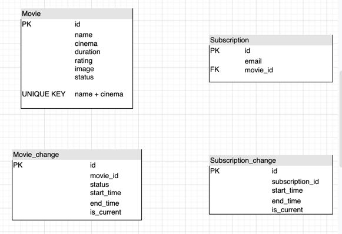

<h1 align="center">Data Engineering</h1>

CinePlex Tracker

## Introduction

This project aims to create a data pipeline with Python, AirFlow, Kafka Connect, ElasticSearch and mongoDB,
which allows users to search movies and subscribe for updates.

## API:
Query Movie: GET /movies/query  
Get Movie: GET /movies/{movie_id}  
Subscribe movie updates: POST /movies/{movie_id}/subs

## Schema

## Architecture ##

## Author
- [@harrison](https://github.com/harrison-yck)