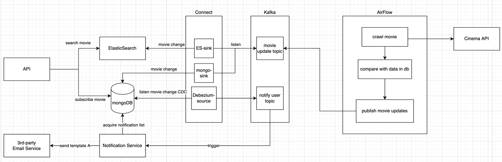

<h1 align="center">Data Engineering</h1>

A project to learn data architecture

## Introduction

This project aims to create a data pipeline with Python, AirFlow, Kafka Connect, ElasticSearch and mongoDB,
which allows users to search movies and subscribe for updates

## API:

## Design

## Architecture ##

## How To Use

## TODO

## Author
- [@harrison](https://github.com/harrison-yck)